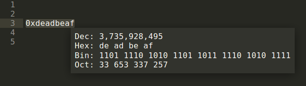

## Plugin that shows a number in 10, 16, 2 and 8 numeral systems for Sublime

This plugin converts the selected number in decimal, hexadecimal, binary or octal numeral systems and displays a popup that shows the result in all four (dec, hex, bin and oct) numeral systems.

Aditional functionality:
* by clicking on any of the numeral systems in the popup window it converts the number;
* pressing any digit of binary number makes it opposit of it's current value;
* the "swap" button swaps the bit positions what can be usefull in some architectures.
