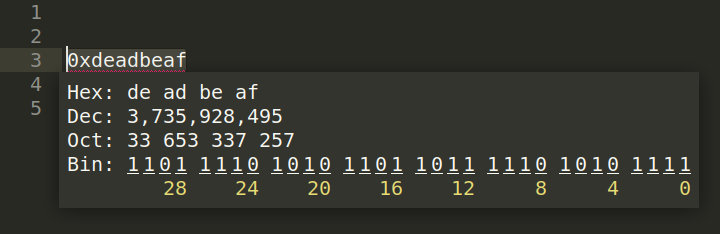

## Plugin that shows a number in 10, 16, 2 and 8 numeral systems for Sublime 3

This plugin converts the selected number in decimal, hexadecimal, binary or octal numeral systems and displays a popup that shows the result in all four (dec, hex, bin and oct) numeral systems. There is two versions of popup window:

*basic*



*extended*


### Aditional functionality
* Pressing any digit of binary number makes it opposit of it's current value.
* "swap" button swaps the bit positions what can be usefull in some architectures.
* Key binding is available for convert numeral system and swap endianness functions.
* In **extended** mode appears buttons to convert numbers and swap endianness.

### Settings
You can setup this plugin settings or key bindings wich can be edited in menu option
`Preferences -> Package Settings -> Display nums -> Settings` or `Key bindings` accordingly.
Or you can define project specific settings by adding "**disnum.**" to the setting option, for example:

*user settings file*
```json
{
	"bytes_in_word": 4
}
```
*project settings file*
```json
{
	"disnum.bytes_in_word": 4
}
```