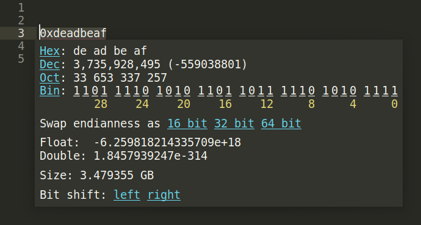

# Plugin that shows a number in 10, 16, 2 and 8 numeral systems for Sublime 3

This plugin converts the selected number in decimal, hexadecimal, binary or octal numeral systems and displays a popup that shows the result in all four (dec, hex, bin and oct) numeral systems.

### Popup modes

*basic* - has minimal information:


*extended* - can convert numbers and supports additions:



*tabled* - backwards compatibility with @kalund :


## Additional functionality
* Pressing any digit of binary number makes it opposite of it's current value.
* Key binding is available for convert numeral system and swap endianness functions.

### Addition: swap endianness
Displays buttons to swap endianness interpreting number as halfword (16 bits), word (32 bits) or doubleword (64 bits).

### Addition: interpret hex number as float
Displays selected number in hex format as IEEE 754:
* float (32 bits) if it is less or equal to 4 bytes length;
* double (64 bits) if it is less or equal to 8 bytes length.

### Addition: interpret number as size in bytes

## Installation
Clone this repository or download zip archive into the Sublime 3 package directory (you can find it in menu option `Preferences -> Browse Packages...`). **Keep in mind** that plugin folder name should be `Display numbers`.

## Settings
You can setup this plugin settings or key bindings which can be edited in menu option
`Preferences -> Package Settings -> Display nums -> Settings` or `Key bindings` accordingly.
Or you can define project specific settings by adding "**disnum.**" to the setting option, for example:

*user settings file*
```json
{
    "plugin_mode": "extended"
}
```
*project settings file*
```json
{
    "disnum.plugin_mode": "tabled"
}
```
